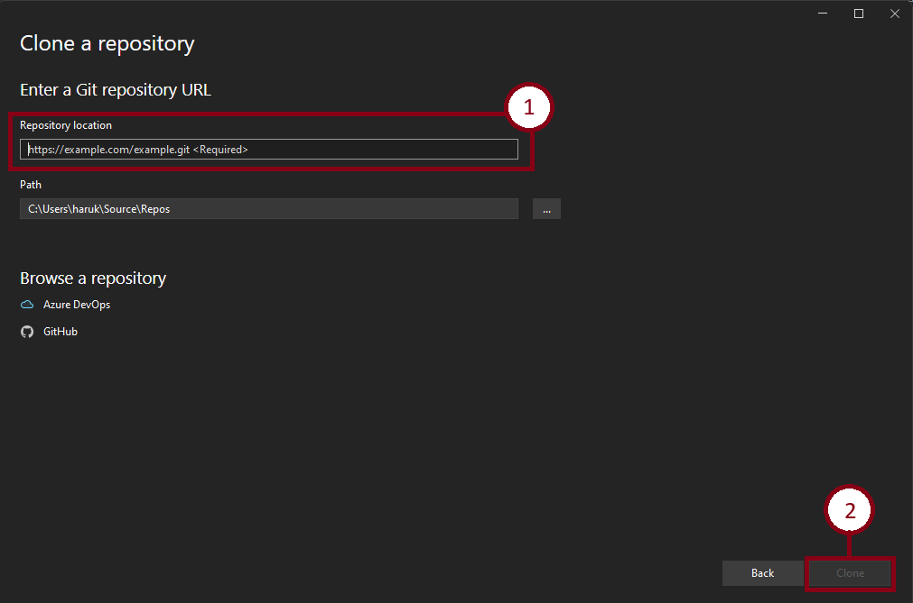
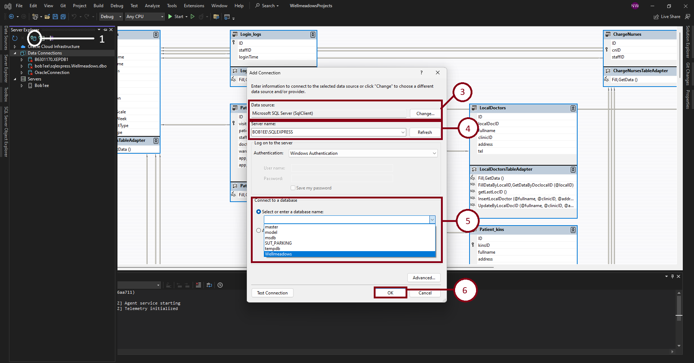
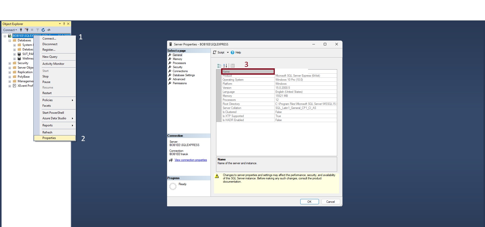
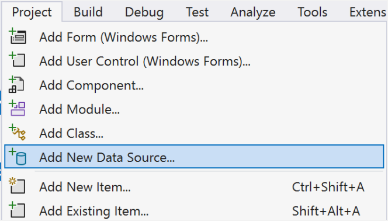
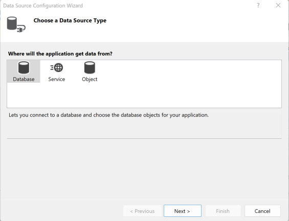
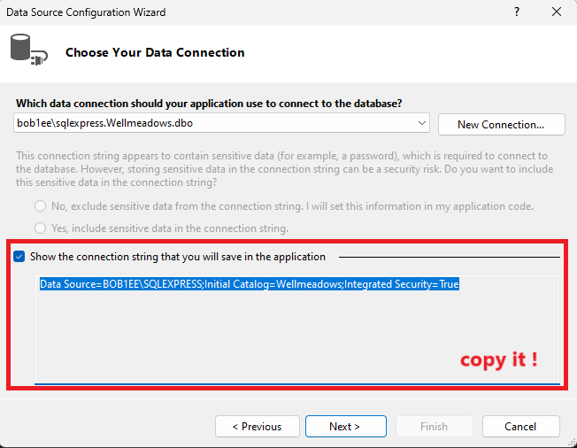
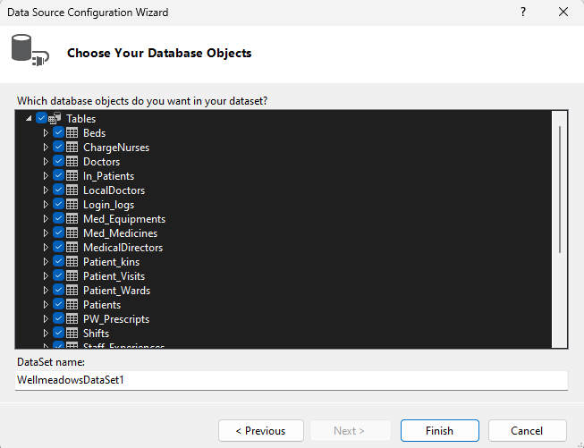

# ระบบฐานข้อมูลโรงพยาบาล Wellmeadows
 ระบบฐานข้อมูลโรงพยาบาลเป็นระบบที่ช่วยในการบริหารจัดการบริการต่างๆ ไม่ว่าจะเป็นระบบสร้างและแก้ไขข้อมูลเจ้าหน้าที่, ค้นหาเจ้าหน้าที่ตามเงื่อนไขที่กำหนด, สร้างและจัดทำรายงานของเจ้าหน้าที่ในแต่ละวอร์ด, สร้างและจัดการข้อมูลผู้ป่วยที่ถูกส่งตัวมารักษายังโรงพยาบาล, สร้าง จัดการข้อมูลและจัดทำรายงานของผู้ป่วยที่ใช้บริการคลินิกผู้ป่วยนอก, สร้างและจัดการข้อมูลผู้ป่วยที่ถูกส่งไปยังแต่ละวอร์ด, จัดทำรายงานรายละเอียดของผู้ป่วยที่อยู่ในวอร์ดในปัจจุบัน, จัดทำรายงานที่แสดงรายละเอียดผู้ป่วยที่อยู่ในรายชื่อผู้ป่วยรอเตียงในแต่ละ
 วอร์ดและ สร้างและจัดการเวชภัณฑ์ที่ถูกจ่ายให้กับผู้ป่วยแต่ละคน โดยระบบนี้เป็นระบบที่ได้พัฒนาขึ้นเพื่อการศึกษาเพียงเท่านั้น!

## ระบบนี้ดำเนินการโดยเทคโนโลยีต่อไปนี้:
- [Visual Studio 2022]
- [SQL Server Management Studio Management Studio 19]
- [Visual Basic.NET]

## วิธีการติดตั้งและการใช้งานโปรเจคนี้:
1. ดาวน์โหลดโปรเจคนี้ได้จากลิ้งด้านล่างนี้:
```sh
https://github.com/Devkubera/WellmeadowsProjects.git
```
2. ทำการเปิดโปรเจคนี้ด้วยโปรแกรม Visual Studio 2022 และเลือก Clone a repository แล้วกด Next จากนั้นใส่ลิ้งด้านบนลงไปในช่อง Repository location และกด Clone ต่อไป:



3. ทำการเปิดโปรแกรม SQL Server Management Studio 19 สร้าง Database จากคำสั่งด้านล่างนี้:
```sh
CREATE DATABASE Wellmeadows 
ON PRIMARY
(
 NAME=wellmeadows_DAT,
 FILENAME='D:\wellmeadows.mdf',
 SIZE=5,
 MAXSIZE=20,
 FILEGROWTH=1
);
GO
USE Wellmeadows; 
ALTER DATABASE Wellmeadows
COLLATE Thai_CI_AI; 
GO
```
4. สร้าง Table จากคำสั่งด้านล่างนี้:
```sh
CREATE TABLE Staffs (
    ID INT IDENTITY(1, 1) UNIQUE,
    staffID AS 'S' + RIGHT('0000' + CAST(ID AS VARCHAR(4)), 4) PERSISTED PRIMARY KEY,
    firstName VARCHAR(50),
    lastName VARCHAR(50),
    address VARCHAR(256),
    tel VARCHAR(10),
    dob DATE,
    nin VARCHAR(20),
    position VARCHAR(50),
    salary FLOAT,
    salaryScale FLOAT,
    hoursWeek INT,
    contactType VARCHAR(30),
    paidType VARCHAR(30),
 gender VARCHAR(30)
);

CREATE TABLE Doctors (
 ID INT IDENTITY(1, 1) UNIQUE,
 doctorID AS 'D' + RIGHT('0000' + CAST(ID AS VARCHAR(4)), 4) PERSISTED PRIMARY KEY,
 staffID VARCHAR(5) UNIQUE,
 isActive VARCHAR(10) DEFAULT 'YES',
 updateAt DATETIME DEFAULT GETDATE()
);

CREATE TABLE ChargeNurses (
 ID INT IDENTITY(1, 1) UNIQUE,
 cnID AS 'CN' + RIGHT('0000' + CAST(ID AS VARCHAR(4)), 4) PERSISTED PRIMARY KEY,
 staffID VARCHAR(5) UNIQUE,
 isActive VARCHAR(10) DEFAULT 'YES',
 updateAt DATETIME DEFAULT GETDATE()
);

CREATE TABLE MedicalDirectors (
 ID INT IDENTITY(1, 1) UNIQUE,
 mdID AS 'MD' + RIGHT('0000' + CAST(ID AS VARCHAR(4)), 4) PERSISTED PRIMARY KEY,
 staffID VARCHAR(5) UNIQUE,
 isActive VARCHAR(10) DEFAULT 'YES',
 updateAt DATETIME DEFAULT GETDATE()
);

CREATE TABLE Staff_Experiences (
    ID INT IDENTITY(1, 1) UNIQUE,
    expID AS 'E' + RIGHT('0000' + CAST(ID AS VARCHAR(4)), 4) PERSISTED PRIMARY KEY,
    staffID VARCHAR(5),
    organization VARCHAR(100),
    position VARCHAR(50),
    startDate DATE,
    endDate DATE
);

CREATE TABLE Staff_Qualificates (
    ID INT IDENTITY(1, 1) UNIQUE,
    qualID AS 'Q' + RIGHT('0000' + CAST(ID AS VARCHAR(4)), 4) PERSISTED PRIMARY KEY,
    staffID VARCHAR(5),
    type VARCHAR(50),
    dates DATE,
    major VARCHAR(50)
);

CREATE TABLE Patients (
    ID INT IDENTITY(1, 1) UNIQUE,
    patientID AS 'P' + RIGHT('0000' + CAST(ID AS VARCHAR(4)), 4) PERSISTED PRIMARY KEY,
    kinsID VARCHAR(5),
    localDocID VARCHAR(5),
    firstName VARCHAR(50),
    lastName VARCHAR(50),
    address VARCHAR(256),
    gender VARCHAR(30),
    marryStatus VARCHAR(30),
    tel VARCHAR(10),
    dob DATE,
    date_register DATE
);

CREATE TABLE Patient_kins (
    ID INT IDENTITY(1, 1) UNIQUE,
    kinsID AS 'K' + RIGHT('0000' + CAST(ID AS VARCHAR(4)), 4) PERSISTED PRIMARY KEY,
    fullname VARCHAR(100),
    address VARCHAR(256),
    relationship VARCHAR(30),
    tel VARCHAR(10)
);

CREATE TABLE LocalDoctors (
    ID INT IDENTITY(1, 1) UNIQUE,
    localDocID AS 'L' + RIGHT('0000' + CAST(ID AS VARCHAR(4)), 4) PERSISTED PRIMARY KEY,
    fullname VARCHAR(100),
    clinicID VARCHAR(10) UNIQUE,
    address VARCHAR(256),
    tel VARCHAR(10)
);

CREATE TABLE Wards (
    ID INT IDENTITY(1, 1) UNIQUE,
    wardID AS 'W' + RIGHT('0000' + CAST(ID AS VARCHAR(4)), 4) PERSISTED PRIMARY KEY,
    wardName VARCHAR(50),
    wardLocation VARCHAR(256),
    wardTel INT
);

CREATE TABLE Beds (
    bedID INT IDENTITY(1, 1) PRIMARY KEY,
    wardID VARCHAR(5)
);

CREATE TABLE Shifts (
    shiftID INT IDENTITY(1, 1) PRIMARY KEY,
    shiftName VARCHAR(50),
    startTime DATETIME,
    endTime DATETIME
);

CREATE TABLE Ward_Staffs (
    wsID INT IDENTITY(1, 1) PRIMARY KEY,
    shiftID INT,
    staffID VARCHAR(5),
    wardID VARCHAR(5)
);

CREATE TABLE Patient_Visits (
    ID INT IDENTITY(1, 1) UNIQUE,
    visitID AS 'V' + RIGHT('0000' + CAST(ID AS VARCHAR(4)), 4) PERSISTED PRIMARY KEY,
    patientID VARCHAR(5),
    staffID VARCHAR(5),
    doctorID VARCHAR(5),
    wardID VARCHAR(5),
    app_date DATE,
    app_type VARCHAR(50)
);

CREATE TABLE Patient_Wards (
    ID INT IDENTITY(1, 1) UNIQUE,
    patientID VARCHAR(5),
    visitID VARCHAR(5),
    doctorID VARCHAR(5),
    cnID VARCHAR(6),
    pwID AS 'PW' + RIGHT('0000' + CAST(ID AS VARCHAR(4)), 4) PERSISTED PRIMARY KEY,
    wardID VARCHAR(5),
    patientType VARCHAR(50),
    on_ward_date DATE,
    symptom VARCHAR(256),
    updateAt DATE
);

CREATE TABLE In_Patients (
    pwID VARCHAR(6) PRIMARY KEY,
    wardID VARCHAR(5),
    bedID INT,
    on_wating_date DATE,
    isGetBed BIT,
    date_place DATE,
    date_expected INT,
    date_leave DATE,
    patient_status BIT
);

CREATE TABLE Suppilers (
    supplierID INT IDENTITY(1, 1) PRIMARY KEY,
    mdID VARCHAR(6),
    name VARCHAR(50),
    address VARCHAR(256),
    tel VARCHAR(10),
    fax VARCHAR(10),
    createAt DATE
);

CREATE TABLE Med_Equipments (
    meID INT IDENTITY(1, 1) PRIMARY KEY,
    supplierID INT,
    name VARCHAR(50),
    description VARCHAR(256),
    stock INT,
    buy_scale FLOAT,
    price_per_unit FLOAT
);

CREATE TABLE Med_Medicines (
    mmID INT IDENTITY(1, 1) PRIMARY KEY,
    supplierID INT,
    name VARCHAR(50),
    description VARCHAR(256),
    dosage INT,
    method VARCHAR(50),
    stock INT,
    buy_scale FLOAT,
    price_per_unit FLOAT
);

CREATE TABLE PW_Prescripts (
    ID Int IDENTITY(1, 1),
    mmID INT,
    pwID VARCHAR(6),
    doctorID VARCHAR(5),
    cnID VARCHAR(6),
    dosage FLOAT,
    startDate DATE,
    endDate DATE,
    descript varchar(50),
    createAT DATETIME DEFAULT GETDATE(),
    PRIMARY KEY (ID)
);

CREATE TABLE Ward_Requests (
    reqID VARCHAR(10) PRIMARY KEY,
    staffID VARCHAR(5),
    cnID VARCHAR(6),
    wardID VARCHAR(5),
    meID INT,
    mmID INT,
    dosage FLOAT,
    counts INT,
    dateReq DATE,
    createAt DATE
);

CREATE TABLE Login_logs (
 ID INT IDENTITY(1, 1) PRIMARY KEY,
    staffID VARCHAR(5),
    loginTime DATETIME
);


ALTER TABLE Staff_Experiences
ADD CONSTRAINT FK_Staff_Experiences_Staffs
FOREIGN KEY (staffID) REFERENCES Staffs (staffID);


ALTER TABLE Staff_Qualificates
ADD CONSTRAINT FK_Staff_Qualificates_Staffs
FOREIGN KEY (staffID) REFERENCES Staffs (staffID);

ALTER TABLE Patients
ADD CONSTRAINT FK_Patients_Patient_kins
FOREIGN KEY (kinsID) REFERENCES Patient_kins (kinsID);

ALTER TABLE Patients
ADD CONSTRAINT FK_Patients_LocalDoctors
FOREIGN KEY (localDocID) REFERENCES LocalDoctors (localDocID);

ALTER TABLE Beds
ADD CONSTRAINT FK_Beds_Wards
FOREIGN KEY (wardID) REFERENCES Wards (wardID);

ALTER TABLE Ward_Staffs
ADD CONSTRAINT FK_Ward_Staffs_Shifts
FOREIGN KEY (shiftID) REFERENCES Shifts (shiftID);

ALTER TABLE Ward_Staffs
ADD CONSTRAINT FK_Ward_Staffs_Staffs
FOREIGN KEY (staffID) REFERENCES Staffs (staffID);

ALTER TABLE Ward_Staffs
ADD CONSTRAINT FK_Ward_Staffs_Wards
FOREIGN KEY (wardID) REFERENCES Wards (wardID);

ALTER TABLE Patient_Visits
ADD CONSTRAINT FK_Patient_Visits_Patients
FOREIGN KEY (patientID) REFERENCES Patients (patientID);

ALTER TABLE Patient_Visits
ADD CONSTRAINT FK_Patient_Visits_Staffs
FOREIGN KEY (staffID) REFERENCES Staffs (staffID);

ALTER TABLE Patient_Visits
ADD CONSTRAINT FK_Patient_Visits_Doctors_Doctor
FOREIGN KEY (doctorID) REFERENCES Doctors (doctorID);

ALTER TABLE Patient_Visits
ADD CONSTRAINT FK_Patient_Visits_Wards
FOREIGN KEY (wardID) REFERENCES Wards (wardID);

ALTER TABLE Patient_Wards
ADD CONSTRAINT FK_Patient_Wards_Patients
FOREIGN KEY (patientID) REFERENCES Patients (patientID);

ALTER TABLE Patient_Wards
ADD CONSTRAINT FK_Patient_Wards_Patient_Visits
FOREIGN KEY (visitID) REFERENCES Patient_Visits (visitID);

ALTER TABLE Patient_Wards
ADD CONSTRAINT FK_Patient_Wards_Staffs_Doctor
FOREIGN KEY (doctorID) REFERENCES Doctors (doctorID);

ALTER TABLE Patient_Wards
ADD CONSTRAINT FK_Patient_Wards_Staffs_cnID
FOREIGN KEY (cnID) REFERENCES ChargeNurses (cnID);

ALTER TABLE Patient_Wards
ADD CONSTRAINT FK_Patient_Wards_Wards
FOREIGN KEY (wardID) REFERENCES Wards (wardID);

ALTER TABLE In_Patients
ADD CONSTRAINT FK_In_Patients_Patient_Wards
FOREIGN KEY (pwID) REFERENCES Patient_Wards (pwID);

ALTER TABLE In_Patients
ADD CONSTRAINT FK_In_Patients_Wards
FOREIGN KEY (wardID) REFERENCES Wards (wardID);

ALTER TABLE In_Patients
ADD CONSTRAINT FK_In_Patients_Beds
FOREIGN KEY (bedID) REFERENCES Beds (bedID);

ALTER TABLE Suppilers
ADD CONSTRAINT FK_Suppilers_Staffs_mdID
FOREIGN KEY (mdID) REFERENCES MedicalDirectors (mdID);

ALTER TABLE Med_Equipments
ADD CONSTRAINT FK_Med_Equipments_Suppilers
FOREIGN KEY (supplierID) REFERENCES Suppilers (supplierID);

ALTER TABLE Med_Medicines
ADD CONSTRAINT FK_Med_Medicines_Suppilers
FOREIGN KEY (supplierID) REFERENCES Suppilers (supplierID);

ALTER TABLE PW_Prescripts
ADD CONSTRAINT FK_PW_Prescripts_Med_Medicines
FOREIGN KEY (mmID) REFERENCES Med_Medicines (mmID);

ALTER TABLE PW_Prescripts
ADD CONSTRAINT FK_PW_Prescripts_Patient_Wards
FOREIGN KEY (pwID) REFERENCES Patient_Wards (pwID);

ALTER TABLE PW_Prescripts
ADD CONSTRAINT FK_PW_Prescripts_Staffs_Doctor
FOREIGN KEY (doctorID) REFERENCES Doctors (doctorID);

ALTER TABLE PW_Prescripts
ADD CONSTRAINT FK_PW_Prescripts_Staffs_cnID
FOREIGN KEY (cnID) REFERENCES ChargeNurses (cnID);

ALTER TABLE Ward_Requests
ADD CONSTRAINT FK_Ward_Requests_Staffs
FOREIGN KEY (staffID) REFERENCES Staffs (staffID);

ALTER TABLE Ward_Requests
ADD CONSTRAINT FK_Ward_Requests_Staffs_cnID
FOREIGN KEY (cnID) REFERENCES ChargeNurses (cnID);

ALTER TABLE Ward_Requests
ADD CONSTRAINT FK_Ward_Requests_Wards
FOREIGN KEY (wardID) REFERENCES Wards (wardID);

ALTER TABLE Ward_Requests
ADD CONSTRAINT FK_Ward_Requests_Med_Equipments
FOREIGN KEY (meID) REFERENCES Med_Equipments (meID);

ALTER TABLE Ward_Requests
ADD CONSTRAINT FK_Ward_Requests_Med_Medicines
FOREIGN KEY (mmID) REFERENCES Med_Medicines (mmID);

ALTER TABLE Login_logs
ADD CONSTRAINT FK_Login_logs_Staffs
FOREIGN KEY (staffID) REFERENCES Staffs (staffID);

ALTER TABLE Doctors
ADD CONSTRAINT FK_Doctors_Staffs
FOREIGN KEY (staffID) REFERENCES Staffs (staffID);

ALTER TABLE MedicalDirectors
ADD CONSTRAINT FK_MedicalDirectors_Staffs
FOREIGN KEY (staffID) REFERENCES Staffs (staffID);

ALTER TABLE ChargeNurses
ADD CONSTRAINT FK_ChargeNurses_Staffs
FOREIGN KEY (staffID) REFERENCES Staffs (staffID);
```

5. ทำการเพิ่มข้อมูลเข้าไปในตารางต่างๆ ด้วยคำสั่งด้านล่างนี้:
```sh
-- Generate mockup data for Staffs table
INSERT INTO Staffs (firstName, lastName, address, tel, dob, nin, position, salary, salaryScale, hoursWeek, contactType, paidType, gender)
VALUES 
  (N'สมชาย', N'ใจดี', N'123 ถนนเสมาะ', '0812345678', '1980-05-15', '1234567890123', N'เจ้าหน้าที่ฝ่ายบุคคล', 35000, 1.2, 40, N'Full-time', N'Salary', 'ชาย'),
  (N'สุรชัย', N'บริสุทธิ์', N'456 ถนนสุขสบาย', '0876543210', '1990-02-20', '9876543210987', N'ผู้อำนวยการโรงพยาบาล', 80000, 1.5, 45, N'Full-time', N'Salary', 'หญิง'),
  (N'รักษ์', N'สิริ', N'789 ถนนหาดใหญ่', '0823456789', '1985-11-10', '5678901234567', N'หัวหน้าพยาบาล', 40000, 1.3, 42, N'Full-time', N'Salary', 'ชาย'),
  (N'ณัฐพงษ์', N'วงศ์คำเหลา', N'989 ถนนหาดใหญ่', '0812234567', '1995-11-10', '5678901234561', N'แพทย์', 50000, 1.1, 48, N'Full-time', N'Salary', 'ชาย');

---- Generate mockup data for Doctors table
INSERT INTO Doctors (staffID) VALUES ('S0004');

-- Generate mockup data for ChargeNurses table
INSERT INTO ChargeNurses (staffID) VALUES ('S0003');

-- Generate mockup data for MedicalDirectors table
INSERT INTO MedicalDirectors (staffID) VALUES ('S0002');

-- Generate mockup data for Staff_Experiences table
INSERT INTO Staff_Experiences (staffID, organization, position, startDate, endDate)
VALUES 
  ( 'S0001', N'โรงพยาบาล A', N'เจ้าหน้าที่ฝ่ายบุคคล', '2005-01-15', '2010-03-20'),
  ( 'S0002', N'โรงพยาบาล B', N'แพทย์', '2012-06-10', '2015-09-25'),
  ( 'S0003', N'โรงพยาบาล C', N'พยาบาล', '2008-03-05', '2014-08-15'),
  ( 'S0004', N'โรงพยาบาล D', N'แพทย์', '2012-06-10', '2015-09-25');

-- Generate mockup data for Staff_Qualificates table
INSERT INTO Staff_Qualificates ( staffID, type, dates, major)
VALUES 
  ( 'S0001', N'ใบประกอบวิชาชีพเจ้าหน้าที่ฝ่ายบุคคล', '2010-05-12', N'เจ้าหน้าที่ฝ่ายบุคคล'),
  ( 'S0002', N'ใบประกอบวิชาชีพแพทย์', '2015-08-20', N'แพทย์'),
  ( 'S0003', N'ใบประกอบวิชาชีพพยาบาล', '2013-04-08', N'พยาบาล'),
  ( 'S0004', N'ใบประกอบวิชาชีพแพทย์', '2015-08-20', N'แพทย์');

  -- Generate mockup data for Patient_kins table
INSERT INTO Patient_kins (fullname, address, relationship, tel)
VALUES 
  (N'ประเสริฐ ใจดี', N'123 ถนนสุขภาพ', N'พี่ชาย', '0812345678'),
  (N'วีระ บุญชัย', N'456 ถนนสะอาด', N'น้องชาย', '0876543210'),
  (N'ปวริศ รักสันต์', N'789 ถนนสุขสบาย', N'น้องชาย', '0823456789');

-- Generate mockup data for LocalDoctors table
INSERT INTO LocalDoctors (fullname, clinicID, address, tel)
VALUES 
  (N'สมรัก ประสิทธิ์', 'CLINIC1', N'123 ถนนคลินิก', '0812345678'),
  (N'วิชัย วงศ์วิไล', 'CLINIC2', N'456 ถนนคลินิก', '0876543210'),
  (N'สมบูรณ์ รักสันต์', 'CLINIC3', N'789 ถนนคลินิก', '0823456789');

-- Generate mockup data for Patients table
INSERT INTO Patients (kinsID, localDocID, firstName, lastName, address, gender, marryStatus, tel, dob, date_register)
VALUES 
  ('K0001', 'L0001', N'สมใจ', N'ประสิทธิ์', N'789 ถนนสวยงาม', N'ชาย', N'โสด', '0865432101', '1995-12-30', '2023-01-05'),
  ( 'K0002','L0002', N'วิภา', N'วงศ์วิไล', N'456 ถนนสุขใจ', N'หญิง', N'สมรส', '0887654321', '1990-08-15', '2023-01-10'),
  ( 'K0001','L0003', N'สุขใจ', N'รักสันต์', N'123 ถนนร่มรื่น', N'ชาย', N'โสด', '0854321098', '1982-03-25', '2023-01-15');


-- Generate mockup data for Wards table
INSERT INTO Wards (wardName, wardLocation, wardTel)
VALUES 
 ('แผนกจักษุ', 'ตึกผู้ป่วยอายุรกรรม', 1101),
    ('แผนกอายุรกรรม', 'ตึกผู้ป่วยอายุรกรรม', 1102),
    ('แผนกสูตินรีเวช', 'ตึกผู้ป่วยสูตินรีเวช', 1103),
    ('แผนกศัลยกรรม', 'ตึกผู้ป่วยศัลยกรรม', 1104),
    ('แผนกเด็ก', 'ตึกผู้ป่วยเด็ก', 1105),
    ('แผนกสมอง', 'ตึกผู้ป่วยสมอง', 1106),
    ('แผนกหัวใจ', 'ตึกผู้ป่วยหัวใจ', 1107),
    ('แผนกทันตกรรม', 'ตึกผู้ป่วยทันตกรรม', 1108),
    ('แผนกผิวหนัง', 'ตึกผู้ป่วยผิวหนัง', 1109),
    ('แผนกตา', 'ตึกผู้ป่วยตา', 1110),
    ('แผนกหูคอจมูก', 'ตึกผู้ป่วยหูคอจมูก', 1111),
    ('แผนกออร์โธปิดิกส์', 'ตึกผู้ป่วยออร์โธปิดิกส์', 1112),
    ('แผนกกายภาพบำบัด', 'ตึกผู้ป่วยกายภาพบำบัด', 1113),
    ('แผนกจิตเวช', 'ตึกผู้ป่วยจิตเวช', 1114),
    ('แผนกฉุกเฉิน', 'ตึกผู้ป่วยฉุกเฉิน', 1115),
    ('แผนกอุบัติเหตุ', 'ตึกผู้ป่วยอุบัติเหตุ', 1116),
    ('แผนกรังสีอนามัย', 'ตึกผู้ป่วยรังสีอนามัย', 1117),
    ('แผนกผู้ป่วยนอก','ตึกผู้ป่วยนอก',1118);

-- Generate mockup data for Beds table
INSERT INTO Beds (wardID) VALUES ('W0001'), ('W0002'), ('W0003'), ('W0004'), ('W0005'), ('W0006');

-- Generate mockup data for Shifts table
INSERT INTO Shifts (shiftName, startTime, endTime)
VALUES 
  (N'เช้า', '08:00', '16:00'),
  (N'บ่าย', '16:00', '00:00'),
  (N'ดึก', '00:00', '08:00');

-- Generate mockup data for Ward_Staffs table
INSERT INTO Ward_Staffs (shiftID, staffID, wardID)
VALUES 
  (1, 'S0001', 'W0001'),
  (2, 'S0002', 'W0002'),
  (3, 'S0003', 'W0002');

-- Generate mockup data for Patient_Visits table
INSERT INTO Patient_Visits ( staffID,patientID, doctorID, wardID, app_date, app_type)
VALUES 
  ( 'S0001','P0001', 'D0001', 'W0001', '2023-02-15', N'ประเมิน'),
  ( 'S0002','P0002', 'D0001', 'W0001', '2023-02-16', N'รักษา'),
  ( 'S0003','P0003', 'D0001', 'W0002', '2023-02-17', N'รักษา');

-- Generate mockup data for Patient_Wards table
INSERT INTO Patient_Wards (patientID, visitID, doctorID, cnID, wardID, patientType, on_ward_date, symptom, updateAt)
VALUES 
  ('P0001', 'V0001', 'D0001', 'CN0001', 'W0001', 'ผู้ป่วยใน', '2023-02-15', N'ปวดหัว', '2023-02-15'),
  ('P0002', 'V0002', 'D0001', 'CN0001', 'W0001','ผู้ป่วยใน', '2023-02-16', N'ไข้สูง', '2023-02-16'),
  ('P0003', 'V0003', 'D0001', 'CN0001', 'W0002', 'ผู้ป่วยนอก', '2023-02-17', N'คลื่นไส้', '2023-02-17');

-- Generate mockup data for In_Patients table
INSERT INTO In_Patients (pwID, wardID, bedID, on_wating_date, isGetBed, date_place, date_expected, date_leave, patient_status)
VALUES 
  ('PW0001', 'W0001', 1, '2023-02-15', 1, '2023-02-15', 7, '2023-02-22', 1),
  ('PW0002', 'W0001', 2, '2023-02-16', 1, '2023-02-16', 5, '2023-02-21', 1),
  ('PW0003', 'W0002', 3, '2023-02-17', 1, '2023-02-17', 6, '2023-02-23', 1);

-- Generate mockup data for Suppilers table
INSERT INTO Suppilers (mdID, name, address, tel, fax, createAt)
VALUES 
  ('MD0001', N'บริษัท ABC จำกัด', N'123 ถนนธุรกิจ', '0812345678', '02-1234567', '2023-01-10'),
  ('MD0001', N'บริษัท XYZ จำกัด', N'456 ถนนการแพทย์', '0876543210', '02-9876543', '2023-01-12');

-- Generate mockup data for Med_Equipments table
INSERT INTO Med_Equipments (supplierID, name, description, stock, buy_scale, price_per_unit)
VALUES 
  (1, N'เครื่องมือการแพทย์ 1', N'เครื่องมือช่วยการรักษา', 20, 1.2, 1500.00),
  (2, N'เครื่องมือการแพทย์ 2', N'เครื่องมือวัดความดัน', 30, 1.5, 800.00);

-- Generate mockup data for Med_Medicines table
INSERT INTO Med_Medicines (supplierID, name, description, dosage, method, stock, buy_scale, price_per_unit)
VALUES 
  (1, N'ยาแก้ปวดท้อง', N'ยาแก้ปวดท้อง 10 มิลลิกรัม', 10, N'น้ำ', 50, 1.3, 15.00),
  (2, N'ยาลดไข้', N'ยาลดไข้ 500 มิลลิกรัม', 5, N'เม็ด', 40, 1.4, 10.00);

-- Generate mockup data for PW_Prescripts table
INSERT INTO PW_Prescripts (mmID, pwID, doctorID, cnID, dosage, startDate, endDate, createAT,descript)
VALUES 
  (1, 'PW0001', 'D0001', 'CN0001', 10.0, '2023-02-15', '2023-02-22', '2023-02-15','ผู้ป่วยเป็นเอดส์ให้ยาแก้ไอแล้ว'),
  (2, 'PW0002', 'D0001', 'CN0001', 5.0, '2023-02-16', '2023-02-21', '2023-02-16','ผู้ป่วยเป็นหมันให้ยาวิตามินแล้ว'),
  (2, 'PW0003', 'D0001', 'CN0001', 2.5, '2023-02-17', '2023-02-23', '2023-02-17','ผู้ป่วยเป็นหวัดให้ยาธาตุน้ำขาวแล้ว');


-- Generate mockup data for Login_logs table
INSERT INTO Login_logs (staffID, loginTime)
VALUES 
  ('S0001', '2023-01-10 08:30:00'),
  ('S0002', '2023-01-12 09:15:00'),
  ('S0003', '2023-01-15 10:00:00');
  
```

6. ทำการเชื่อม Visual Studio เข้ากับฐานข้อมูล Wellmeadows โดยไปที่ Tools > Connect to 
Database หรือจะทำตามดังภาพด้านล่างนี้ได้เช่นกัน:



7. กรณีไม่พบ Server name ให้เข้าโปรแกรม Microsoft SQL Server Manament Studio แล้วคลิก
ขวาที่ Server ดังภาพด้านล่างจากนั้นเลือก Properties ชื่อ Server และ Instance จะปรากฏในช่อง
Name ให้ทำการ Copy ข้อความนั้นมาดังภาพด้านล่างนี้:



8. สร้าง Data Source ใหม่โดยไปที่ Project > Add New Data Source ดังภาพด้านล่างนี้:




9. เลือกว่าแอปพลิเคชันจะดึงข้อมูลมาจากที่ไหน โดยเราจะดึงข้อมูลมาจาก Database จากนั้นกด Next จากนั้นเลือก Dataset และ กด Next ดังภาพด้านล่างนี้: 



10. เลือก Data Connection โดยเลือก Wellmeadows ที่ได้จากการเชื่อมก่อนหน้าจากนั้นกด Next 
หรือหากต้องการเชื่อมตัวอื่นให้ทำการกด New Connection แล้วทำการเชื่อมต่อ Data Connection ที่
ต้องการอีกรอบ



11. จากนั้นเลือก Database Objects ที่เราสร้างเอาคือ Table, View ดังภาพด้านล่าง:



12. เสร็จสิ้นกระบวนการทั้งหมดเรียบร้อยแล้ว สามารถที่จะเริ่มต้นการรันโปรแกรมได้เลย!!!
